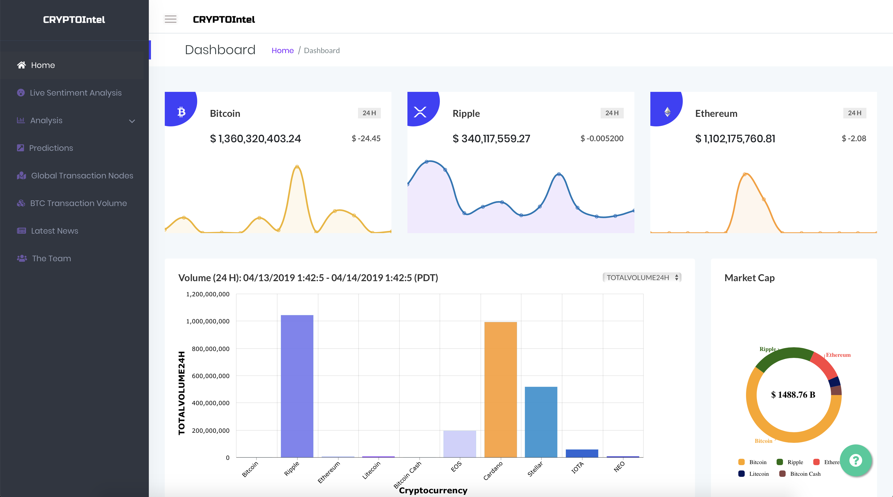

# CRYPTOIntel - Digging Deep Into The Crypto World

You can simply view our dashboard at http://nml-cloud-20.cs.sfu.ca/cryptointel/

CryptoIntel is a one stop dashboard which gives all the information about cryptocurrencies. All the inquisitive users can get their answers related to cryptocurrencies from cryptointel.

- Technologies: Python, Spark, MLlib, Cassandra, NLTK, Pandas, D3, Three.js, Oimo.js, Keras, Gensim, Matplotlib, Plotly, Scikit-learn, PHP and Android Studio
- Database: Cassandra

### Files
- webfront - The web dhasboard
- cryptocompare - all the files relating to fetching data from cryptocompare and EDA
- livesentimentanalysis - To Run live sentiment analysis 
- model_data_prep - Files to prepare data for Keras models
- models - Files relating to running the Keras models
- news_cc - News LDA
- TopicModeling.py - For topic modeling
- Sentiment_predictor.ipynb - For sentiment analysis
- Correlation-matrix.ipynb - Creating Correlation Matrix
- livesentimentcommands.txt - For running the crontasks

### For running the project:
- Install the apache PHP server
- Put the folder webfront in /var/www/html
- Use cql_commands.txt to create cassandra tables
- Populate the cassandra table from the various files above
- start the apache server

### Our Dashboard

### Contributors
- Tushar Chand Kapoor
- Mehak Parashar
- Syed Ikram